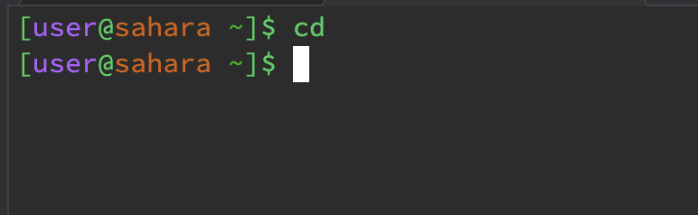
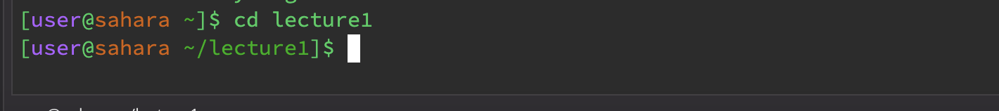
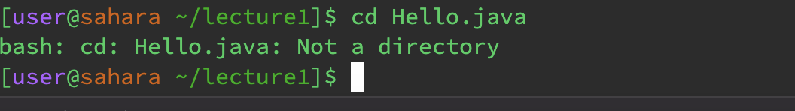
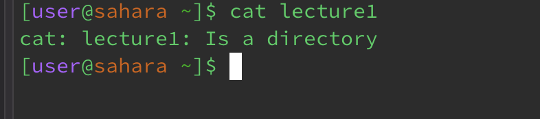
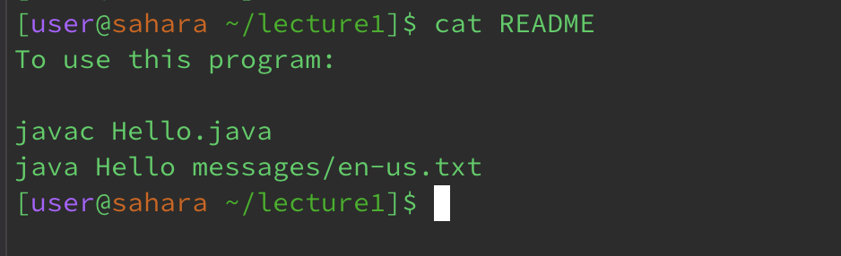

# **Lab Report 1**
## **cd with no arguments**

1. The working directory was `home`
2. I got this output (nothing) because the command `cd` is supposed to change the directory we are in, so if there is no argument then the directory is not being changed, so nothing happens.
3. The output is not an error.

## **cd with directory**

1. The working directory was `home`
2. There wasn't an actual output when I passed in a directory into the argument, but it changed the terminal by changing the directory to lecture1, which is was we wanted and expected from this.
3. The output is not an error.

## **cd with file**

1. The working directory was `lecture1`
2. I got an output saying that the file I put in as an argument is not a directory, and that makes sense in this situation because `cd` is used to change the directory we are in and `Hello.java` is not a directory.
3. The output was an error and its an error because we put in a file as an argument when it only takes in a directory.

## **ls with no argument**

1. The working directory was `home`
2. I got the output of `lecture1` and that is because `ls` prints out all the files and folders from the current working directory, and since I had no argument, it printed out the folder in the home directory.
3. The output is not an error.

## **ls with directory**

1. The working directory was `home`.
2. I got the output of `Hello.class` `Hello.java` `messages` `README`, and that is because `ls` prints out all of the files and folders under the current directory, and these are the files under the lecture1 directory
3. The output is not an error.

## **ls with file**

1. The working directory was `lecture1`.
2. I got the output of `Hello.java` and that is because I passed in the argument `Hello.java`. When specified, `ls` prints out the file that is passed in as the argument.
3. The output is not an error.

## **cat with no arg**

1. The working directory was `home`.
2. There wasn't really an output when I typed in `cat` by itself. The only thing it did was show a blank space in the terminal, and whatever you typed, it was duplicated.
3. The output is not an error

## **cat with directory**

1. The working directory was `home`.
2. The output printed out that the directory I passed in as the argument is a directory. It is trying to tell me that you cannot use a directory with the `cat` command since `cat` prints out the contents of files.
3. The output is sort of an error since `cat` does not use directories.

## **cat with file**

1. The working directory was `lecture1`.
2. The output printed out the contents of the file `README`, which I passed in as the argument. This is our expected output since `cat` concatenates and prints out the contents of the file.
3. The output is not an error.
