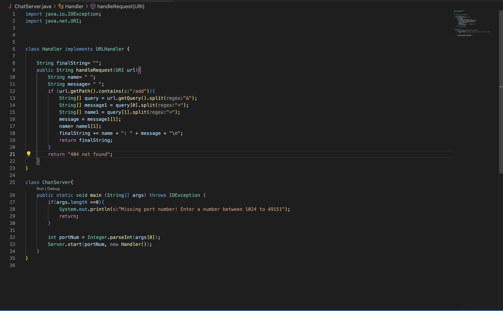
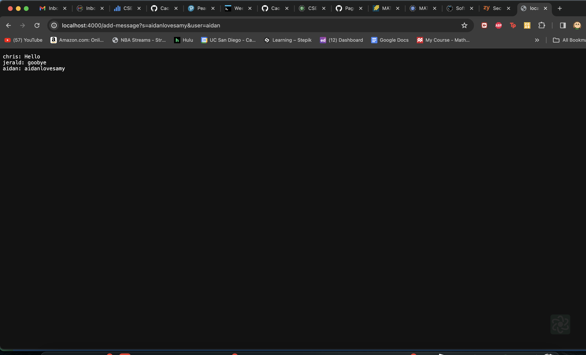
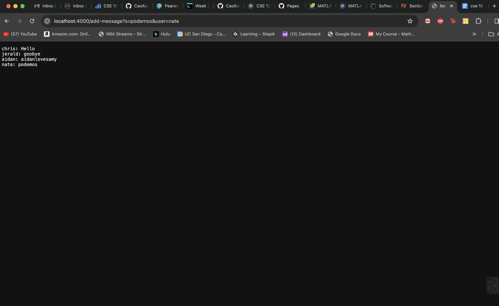
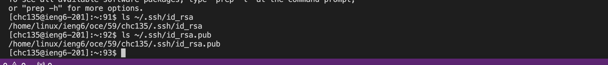
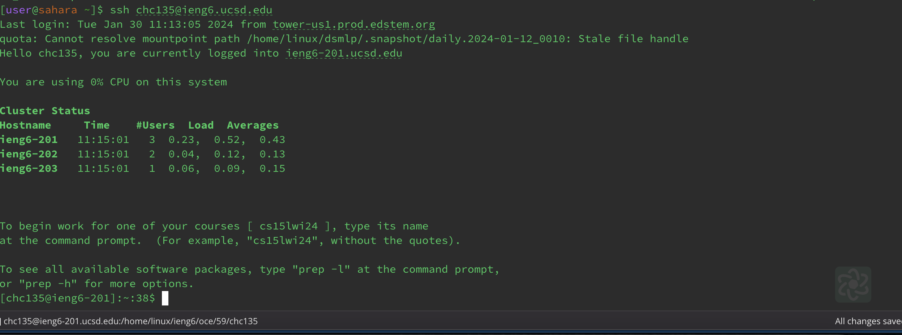

# **Lab 2** 
## **Part 1**

There are multiple methods in my code that are called when I add a message, such as `getPath()`, `getQuery()`, and `split()`. The `getPath()` and `getQuery()` methods don’t have any arguments, but they require a url to be able to work. The `split()` method requires a string argument because that string dictates where the longer string will be split. I created three relevant fields in this class - a `name` string, a `message` string, and a `finalString` string. The `name` string gets updated to the user that's passed in when /add is run, and the `message` string gets updated to the message that is passed in when `/add` is run. The `finalString` string concatenates the `<user> : <message>` string everytime the `/add` method is run.

**This is one instance of me using /add-message.**

**This is another instance of me using /add-message.**

## **Part 2**

The first line is the absolute path of the private key, and the second line is the aboslute path of the public key, hence the `.pub` at the end of the path.

This in an instance of me logging into my ieng6 account in the terminal **without** being asked for my password.
