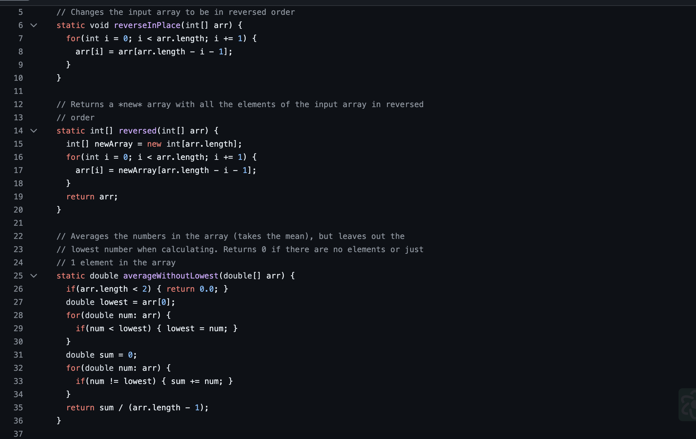
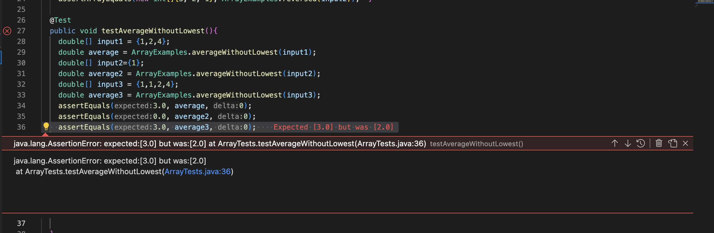

# **Lab 3** 
## **Part 1 - Bugs**

This is the `ArrayExamples.java` class that we were provided during the lab which contains three buggy methods that produces the wrong output given certain inputs. The bug that I will be focusing on in this lab report is the `averageWithoutLowest()` method.

**Faliure inducing input:** 
  `double[] input3 = {1,1,2,4};
  double average3 = ArrayExamples.averageWithoutLowest(input3);
  assertEquals(3.0, average3);`

  This input produces a faulty output because when diving to get the average of the numbers, the program does not account for multiple "lowest" being   removed, only one of them.

**Non-Faliure inducing input:**
  `double[] input1 = {1,2,4};
  double average1 = ArrayExamples.averageWithoutLowest(input1);
  assertEquals(3.0, average1);`

  This input does not produce a faulty output because since there is only one "lowest", the program accounts for that and divides the remaning numbers by the length of the array minus one, which makes sense since there is only one number being removed.

