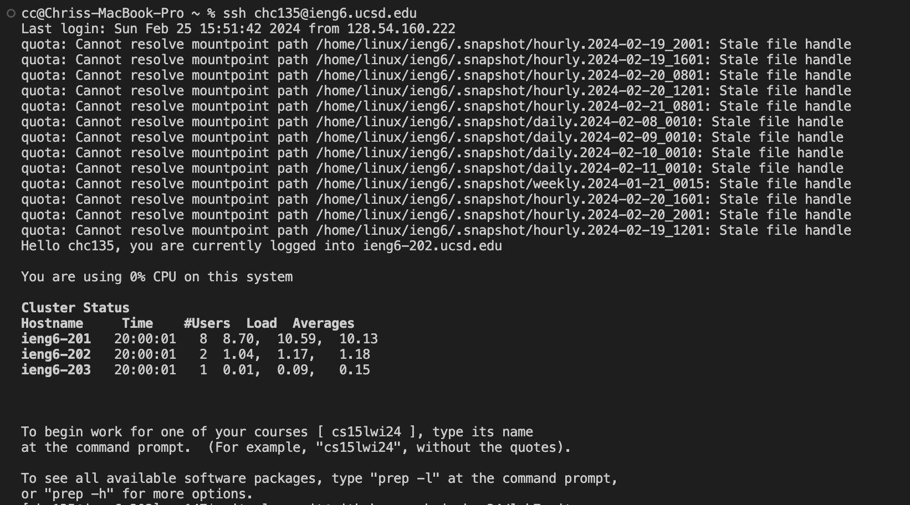
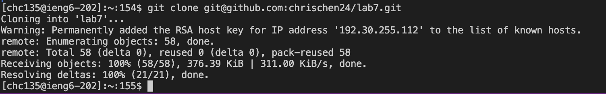
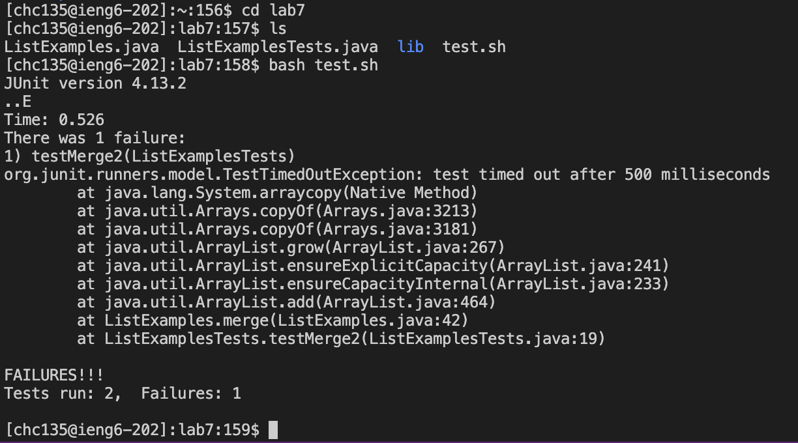
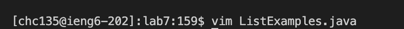
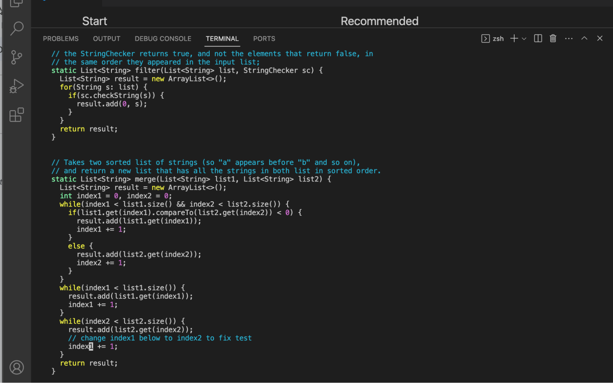
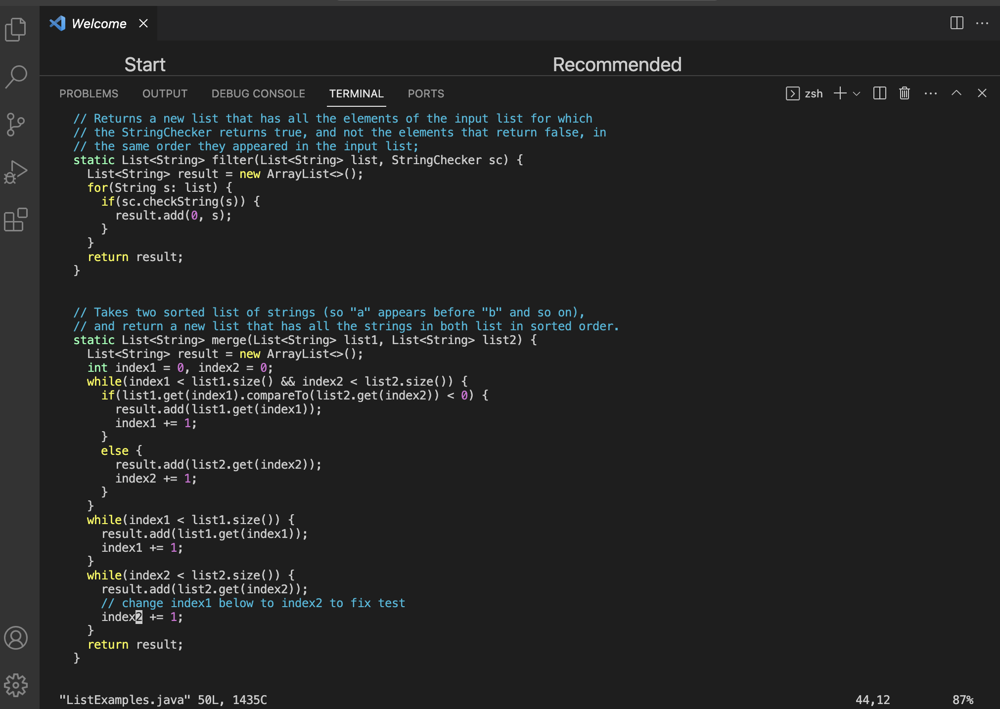
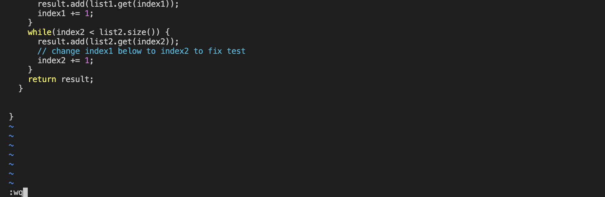
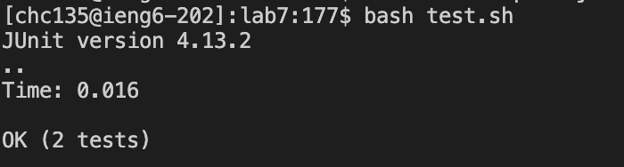

# **Lab4 - Vim (Steps 4-9)**
## **Step 4 - Log into ieng6**

- The command that I used during this step to login to my `ieng6` accound was `ssh chc135@ieng6.ucsd.edu`.

## **Step 5 - Clone forked repository**

- The command I used during this step to clone the forked repository from my Github account (the `SSH` URL) was `git clone git@github.com:chrischen24/lab7.git`.

## **Step 6 - Show that tests fail**

- I first changed the into the `lab7` directory from my current directory by using `cd lab7`.
- Then I used the `ls` command to list the files that were in the `lab7` directory.
- Seeing that there was a `test.sh` shell script file, I used `bash test.sh` to run the `test.sh` file. After it ran, we can see that 2 tests were run and 1 of them failed.

## **Step 7 - Edit the code**

- To edit the file using the vim text editor, I used the command `vim ListExamples.java` to enter `vim` on the `ListExamples.java` file.

- Once I entered the `vim`, my cursor was already on the `index1` variable that I needed to change.

- Since my cusor was already on the `1` of `index1`, all I had to do was click `<r>` which is used to replace a single character, and then I typed `<2>` to change the `index1` to `index2`.

- After making the changed I needed, I typed `<:><w><q>`. This types out `:wq` on the bottom of the file in `vim`, which should allow us to save the changes we made and exit out of `vim`. I then clicked `<enter>` to actually save our changed and exit out of `vim`.

## **Step 8 - Show that tests pass**

- I used the command `bash test.sh` again to re-run the tests, and this time it shows that two tests ran and none failed.

