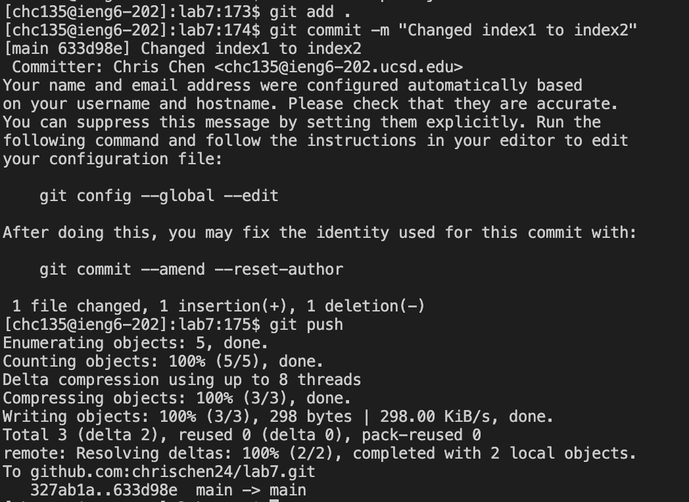

# **Lab4 - Vim (Steps 4-9)**
## **Step 4 - Log into `ieng6`**

- The command that I used during this step to login to my `ieng6` accound was `ssh chc135@ieng6.ucsd.edu` `<enter>`.

## **Step 5 - Clone forked repository**

- The command I used during this step to clone the forked repository from my Github account (the `SSH` URL) was `git clone git@github.com:chrischen24/lab7.git` `<enter>`.

## **Step 6 - Show that tests fail**

- I first changed the into the `lab7` directory from my current directory by using `cd lab7` `<enter>`.
- Then I used the `ls` `<enter>` command to list the files that were in the `lab7` directory.
- Seeing that there was a `test.sh` shell script file, I used `bash test.sh` `<enter>` to run the `test.sh` file. After it ran, we can see that 2 tests were run and 1 of them failed.

## **Step 7 - Edit the code**

- To edit the file using the vim text editor, I used the command `vim ListExamples.java` `<enter>` to enter `vim` on the `ListExamples.java` file.

- Once I entered the `vim`, my cursor was already on the `index1` variable that I needed to change.

- Since my cusor was already on the `1` of `index1`, all I had to do was click `<r>` which is used to replace a single character, and then I typed `<2>` to change the `index1` to `index2`.

- After making the changed I needed, I typed `<esc>` `<:><w><q>`. This puts me back into command mode and types out `:wq` on the bottom of the file in `vim`, which should allow us to save the changes we made and exit out of `vim`. I then clicked `<enter>` to actually save our changed and exit out of `vim`.

## **Step 8 - Show that tests pass**

- I used the command `bash test.sh` `<enter>` again to re-run the tests, and this time it shows that two tests ran and none failed.

## **Step 9 - Commit and push changes**

- I first used `git add .` `<enter>` to stage all files in the directory for it to be committed. This is essentially just preparing the files to be committed and pushed. I then used `git commit -m "Changed index1 to index2"` `<enter>` to actually record and save the changes that were made, and the `-m` allows me to attach a message to my commitment. The `git push` `<enter>` command actually takes the saved changes from my local repository and sends them to the remote repository which is on our github page.

