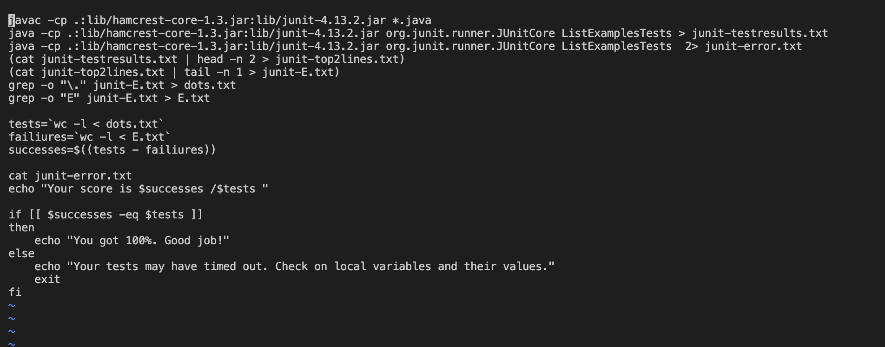
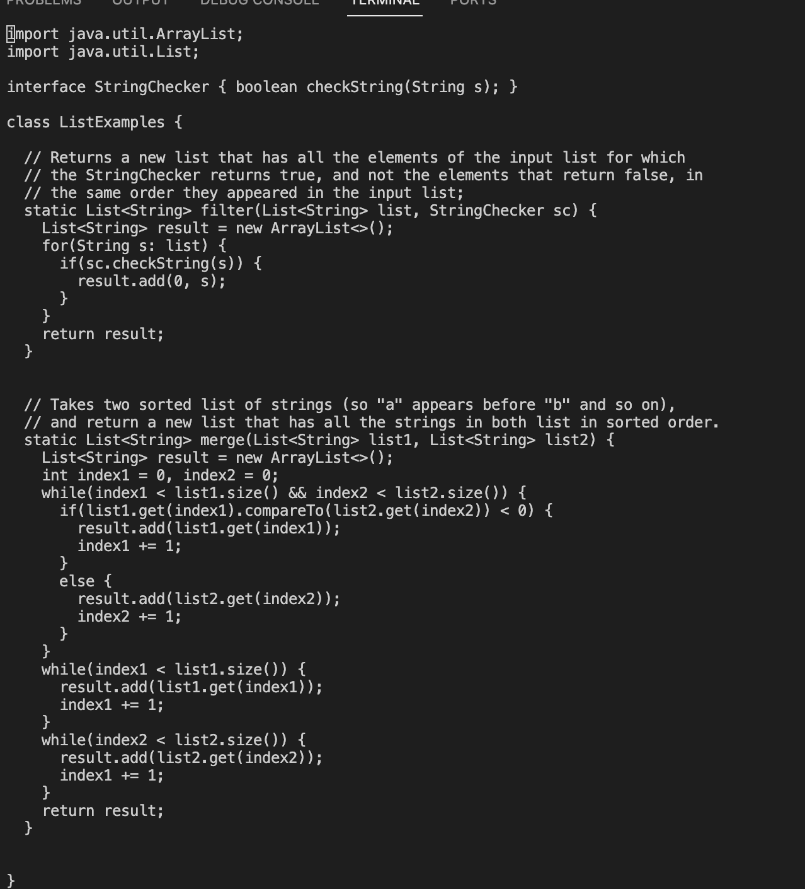
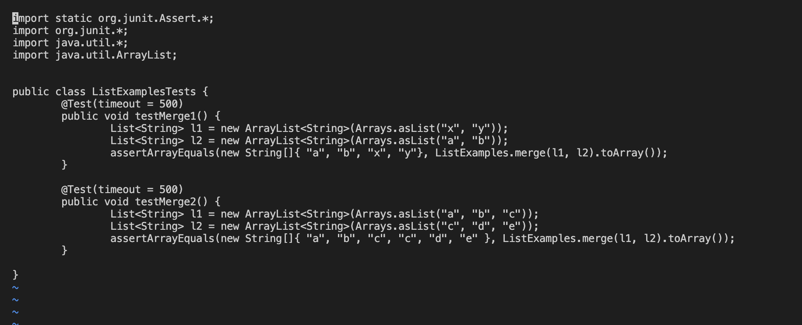

# **Lab Report 5**
## **Part 1- Debugging Scenario**

* ### **Anonymous Student**
   *2 hours ago in general*

  Hello super helpful TA's. I am having an issue with my test cases and im super frustrated. When I run the bash script to test my methods and grade 
  the testers, it produces an error saying that my test timed out. 
  
  I have a bash sript that automatically compliles all of the files and runs the test file, and grades my tests accordingly.
  
  Here is the the code for the methods themselves and the test cases. Any help would be appreciated!
   

* ### **Chris Chen (super helpful TA)**
   *1 hour ago in general*

  Wow that is a alot of code. I can understand why you may be frustrated, but let's take this one step at a time. So, based off of the error output,     we can see that your test failed due to it timing out. We can also see that it is an issue with your second method in your test class, `testMerge2`.   This also makes sense since there is a condition in your test case that causes it to time out after 500 milliseconds, which is exactly what happened. One reason for tests timing out could be that something is stuck in a loop. An important thing for while and for loops is making sure 
  that variables are being updated accordingly, and making sure that the preconditions are valid conditions.
  
  Looking at your `merge` method in `ListExamples`, I can see that you have two while loops in there. Try making sure that those variables being     updated are the correct varibales/being updated properly according to your program. If you have more questions/issues after that, feel free to make    another post.
